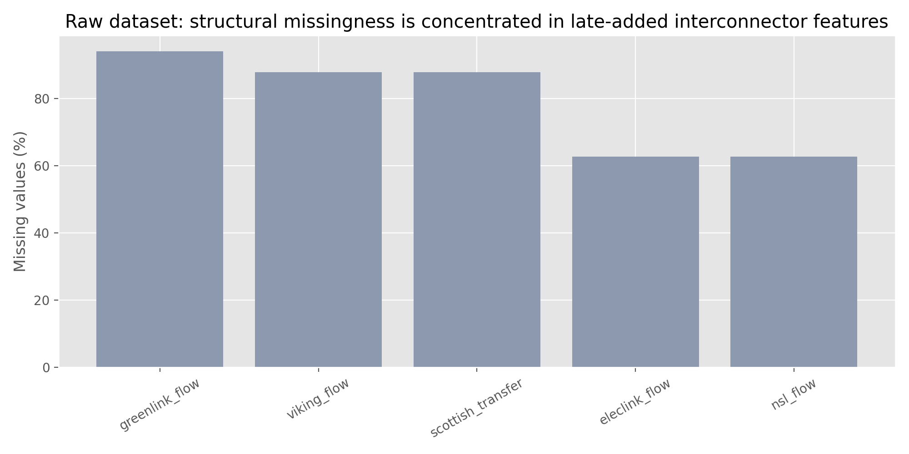
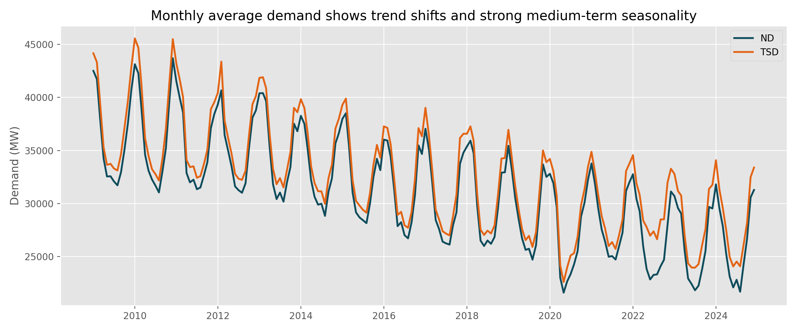
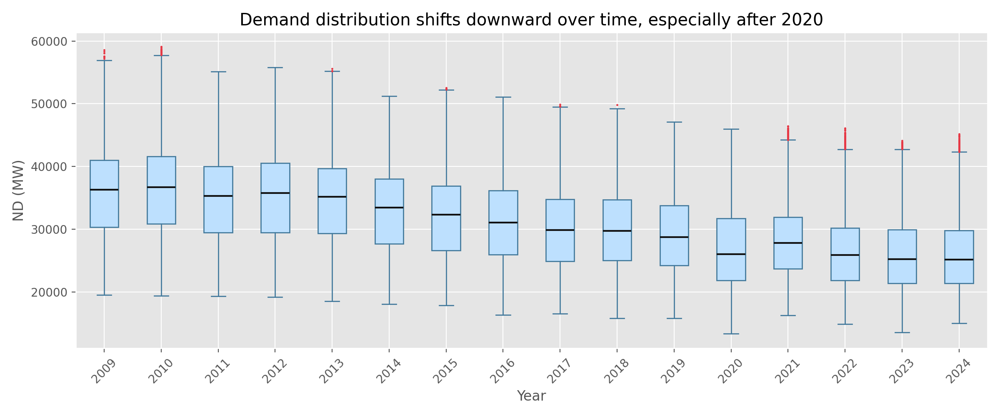
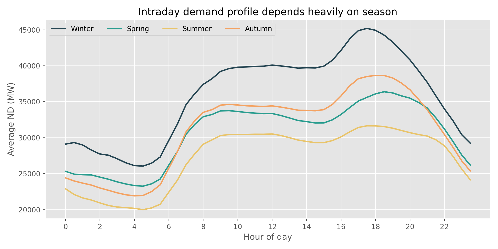
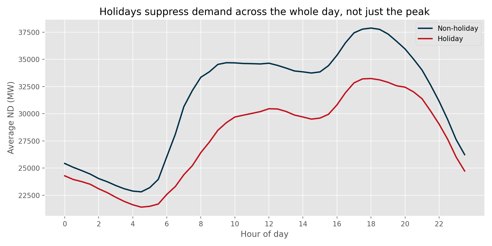
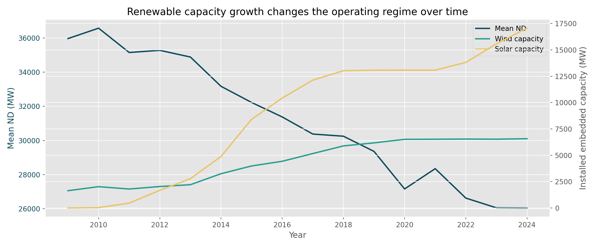
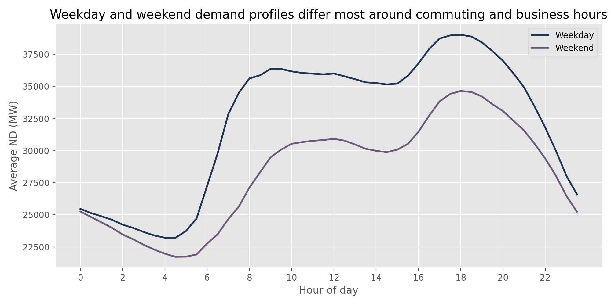
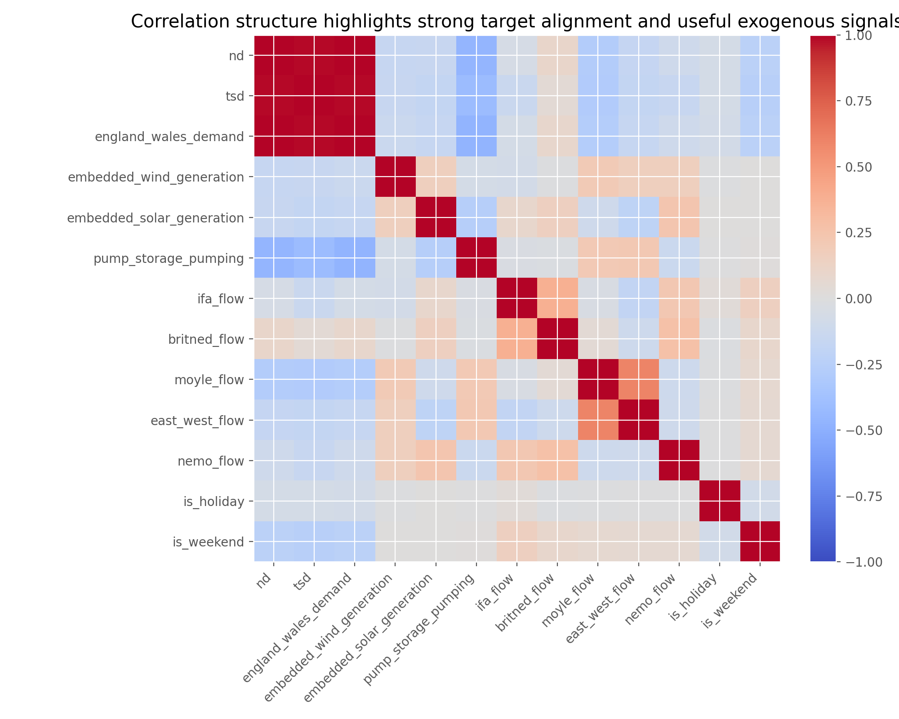

# EDA Findings for UK Electricity Demand Forecasting

This document records our exploratory findings from the historical UK electricity demand dataset and the modelling implications we want to carry into the PyTorch pipeline.

## Dataset summary

- Time span: `2009-01-01 00:00:00` to `2024-12-05 23:30:00`
- Frequency: half-hourly observations
- Primary target variables: `nd` and `tsd`
- Important exogenous variables: embedded wind generation, embedded solar generation, installed wind capacity, installed solar capacity, interconnector flows, storage-related variables, and holiday indicators

The cleaned modelling table contains `278,512` rows. The historical coverage is long enough to expose not only short-term seasonality but also structural changes in the underlying power system.

## 1. Raw data integrity checks

Before focusing on seasonality and feature relationships, the raw table needs a small number of integrity checks.

Two issues stand out:

- `32` rows have `settlement_period > 48`, even though half-hour settlement periods should only run from `1` to `48`
- `479` raw rows have `tsd = 0`, concentrated on `15` calendar dates

These patterns are unlikely to represent genuine electricity demand. The most plausible explanation is logging or ingestion faults rather than real system behaviour. This matters because a neural model can overfit such artefacts very easily, especially if they are rare and extreme.

For our workflow, this supports the same practical decision as in the cleaned file:

- remove impossible settlement periods
- avoid training directly on zero-demand anomalies
- treat the cleaned table as the default starting point for all PyTorch experiments

This is one of the more useful takeaways from the external notebook you shared: it highlights that preprocessing here is not only about filling missing values, but also about identifying physically implausible records.

## 2. Structural missingness in the raw dataset



The raw dataset does not show a diffuse missing-value problem. Missingness is concentrated in a small group of interconnector-related variables, especially `greenlink_flow`, `viking_flow`, `scottish_transfer`, `eleclink_flow`, and `nsl_flow`.

We interpret this pattern as feature availability changing over time rather than random data corruption. A plausible explanation is that some assets entered operation later in the observation window, so early years naturally contain empty values for those columns. This distinction matters because it changes how we should preprocess the data:

- A single generic imputation rule is likely to distort early-year behaviour.
- The cleaned `noNaN` dataset is a sensible starting point for the first modelling iteration.
- If we later reintroduce these sparse variables, we should treat them as regime-dependent features and consider feature masks or availability-aware preprocessing.

This also suggests a practical modelling direction: start from a stable subset of variables, then test whether adding late-appearing infrastructure features improves recent-period forecasting enough to justify the extra complexity.

## 3. Long-term demand trend and regime change



Both `nd` and `tsd` show strong recurring annual cycles, with consistently higher levels in winter and lower levels in summer. The broader pattern is not purely seasonal, however. The average demand level declines over the full time range, and the drop after 2020 is especially visible.

One reasonable interpretation is that this series reflects a combination of weather variation, behavioural change, economic shifts, and a changing generation mix. From a forecasting perspective, the key point is that the underlying distribution is moving over time.

That observation has direct consequences for our modelling choices:

- We should split the data chronologically rather than randomly.
- Normalisation parameters should be fitted on the training period only.
- Model evaluation should emphasise recent holdout periods, because strong performance on early years does not guarantee strong performance on later years.

This figure also suggests that a model with enough temporal capacity to learn both recurring seasonal structure and slower drift is likely to outperform a purely local baseline.

## 4. Year-to-year distribution shift



The yearly boxplots reinforce the same message from a distributional angle. The center of the distribution moves downward over time, and the post-2020 years occupy a noticeably different operating range from many earlier years.

This pattern suggests that the forecasting task is not just about learning a fixed daily cycle. The model also needs to generalise across changing system conditions. A reasonable hypothesis is that exogenous features such as renewable generation and holiday indicators will become more valuable precisely because the target distribution is not stable.

For modelling, this supports:

- walk-forward validation or at least a strict train/validation/test timeline
- careful comparison between univariate and multivariate inputs
- reporting errors by period, not just a single aggregate metric

## 5. Intraday structure and seasonal dependence



The daily demand profile has a clear and highly repeatable shape. Demand is lowest during the early morning, ramps up after around `06:00`, and reaches its strongest peak in the late afternoon to early evening, roughly `17:00-19:00`.

The size of that peak depends strongly on season. Winter demand is substantially higher than summer demand across most of the day, and especially around the evening peak. This suggests that the model should not treat all hours as equally informative. Some time positions are consistently associated with much sharper load changes than others.

A plausible modelling interpretation is that:

- cyclical time encodings for hour-of-day and month should help
- explicit weekly features should help as well, because recurring human activity patterns are visible beyond the daily cycle
- recent lags alone may be insufficient to capture the seasonal change in peak magnitude
- errors near the evening peak may deserve extra attention because they are operationally important and structurally harder

This is a strong argument for using a multivariate sequence model in PyTorch with explicit calendar features rather than relying only on lagged target history.

## 6. Holiday effect



Holiday demand is consistently below non-holiday demand throughout the day. The difference is not confined to a narrow time window; instead, the entire daily profile shifts downward. Around `18:00`, the average gap is about `4,640 MW`.

This pattern suggests that holidays act more like a systematic level shift than a local anomaly. In practice, that means the model should receive holiday information explicitly rather than being expected to infer it from recent target values.

This also points to a broader idea for feature engineering: if one binary calendar variable already produces a visible separation, then other calendar features such as weekday/weekend or bank-holiday adjacency may also be worth testing in later experiments.

## 7. Renewable expansion and changing system behaviour



Installed embedded wind capacity rises from roughly `1,642 MW` in 2009 to about `6,575 MW` in 2024, while installed embedded solar capacity grows from `0 MW` to roughly `17,064 MW`. Over the same period, mean `nd` falls from about `35,966 MW` to about `26,043 MW`.

We should be careful not to claim direct causality from this figure alone, but it clearly indicates that the operating environment changes substantially over time. Renewable growth is one plausible contributor to the evolving relationship between observed demand, net demand, and the rest of the system.

For modelling, this motivates:

- keeping renewable generation and capacity features in the multivariate input set
- evaluating whether later years benefit more from renewable-related covariates than earlier years
- checking whether a single model across the full history is sufficient, or whether performance degrades because the mapping itself changes over time

This figure is also useful for justifying why a modern sequence model may have an advantage over simpler baselines: the data-generating process is not static.

## 8. Weekday versus weekend behaviour



The weekday and weekend profiles separate most clearly during working-day hours and around the evening ramp. At `18:00`, the average weekday demand is about `4,376 MW` higher than the weekend level.

This suggests that part of the load shape is tied to recurring social and commercial activity rather than only weather or season. That makes weekday/weekend information a useful candidate feature even though it is not explicitly included in the current cleaned table.

For the PyTorch pipeline, this points to a simple extension worth testing early:

- derive weekday from the timestamp
- encode it either as a binary weekend flag or as a full day-of-week categorical signal
- compare whether it improves peak-period accuracy

This is also consistent with one of the stronger observations in the external notebook: the model predictions themselves often begin to reflect weekday structure even when peak amplitude is not captured perfectly. That makes day-of-week information a sensible feature to include from the start rather than an optional refinement.

## 9. Correlation structure of the main signals



The correlation view helps separate variables that are almost direct target proxies from those that may contribute complementary information. As expected, `tsd` and `england_wales_demand` are strongly aligned with `nd`, while `pump_storage_pumping`, `is_weekend`, and renewable generation variables show more moderate negative relationships.

We should avoid over-interpreting correlation as causality, but this figure is still useful for feature prioritisation. A plausible reading is that:

- `tsd` and `england_wales_demand` are highly informative but may be too close to the target depending on the exact prediction setup
- calendar-derived features are likely to matter because `is_weekend` is already visibly associated with lower demand
- renewable and storage-related variables are unlikely to dominate the target alone, but may become valuable in combination with lagged history and calendar context

For modelling, this supports building feature sets incrementally instead of throwing every column into the first network version.

## 10. Lag design ideas suggested by the observed seasonality

The combined daily, weekly, and yearly structure suggests that lag design deserves explicit attention rather than being left entirely to the network.

Reasonable candidate inputs for the first PyTorch experiments are:

- short-range lags covering the recent few hours
- one-day seasonal references
- one-week seasonal references

The external notebook also uses a `364-day` lag to preserve day-of-week alignment across years. We do not need to adopt that exact design immediately, but the idea is useful: lag choice should respect calendar structure, not just raw distance in time.

For our first model version, the cleanest approach is likely:

- recent autoregressive window for local dynamics
- explicit calendar features for hour, month, holiday, and weekday
- exogenous renewable and storage variables

Then, if needed, we can test longer seasonal skip connections in later experiments.

## 11. Core takeaways for modelling

The current EDA supports the following design choices:

1. Use chronological splitting and time-aware evaluation only.
2. Start with the cleaned dataset to avoid mixing structural missingness with standard noise handling.
3. Keep calendar features such as hour, month, holiday indicators, and weekday/weekend information in the model input.
4. Treat renewable generation and capacity as meaningful exogenous variables rather than optional extras, but add them incrementally and evaluate their contribution.
5. Remove physically implausible records from the raw table before any custom preprocessing.
6. Compare simple baselines against a PyTorch multivariate forecasting model, especially on recent years where regime shift is more visible.

## Reproducibility

Main script:
- `EDA Report/eda/generate_eda.py`

Figures:
- `EDA Report/eda/figures`

Summary tables:
- `EDA Report/eda/outputs`

Recommended micromamba command:

```bash
micromamba env create -f "EDA Report/eda/environment-micromamba.yml"
micromamba run -n comp0197-pytorch-eda python "EDA Report/eda/generate_eda.py"
```

The EDA script itself depends on `pandas`, `numpy`, and `matplotlib`. The environment file also includes `pytorch` so that the analysis environment matches the framework choice for the later modelling stage.
